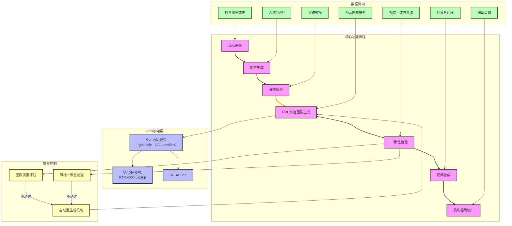
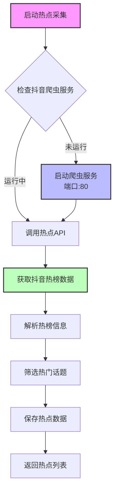
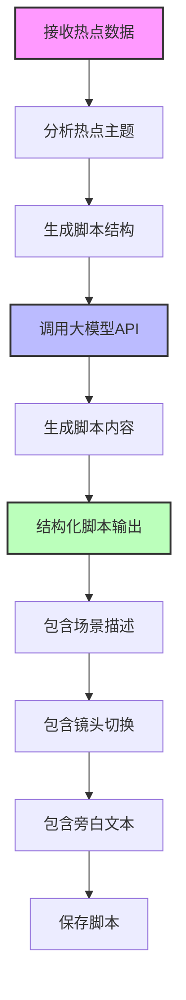
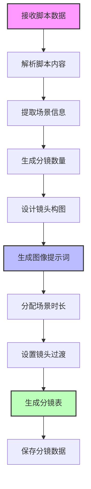
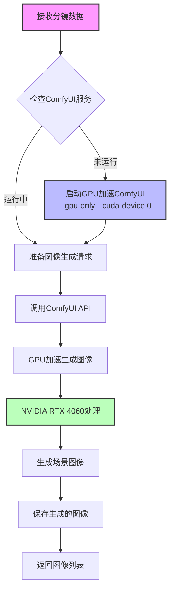
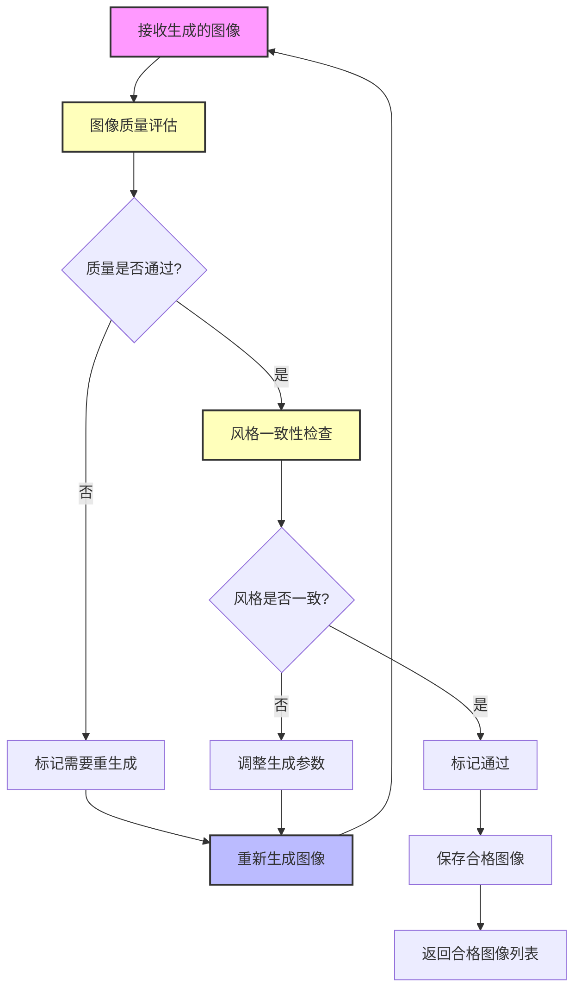
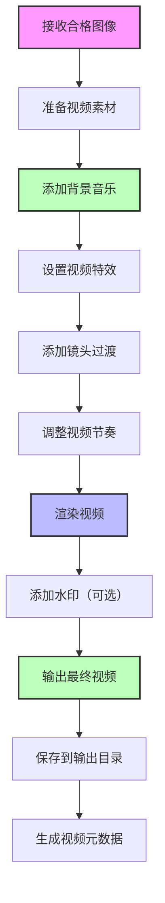
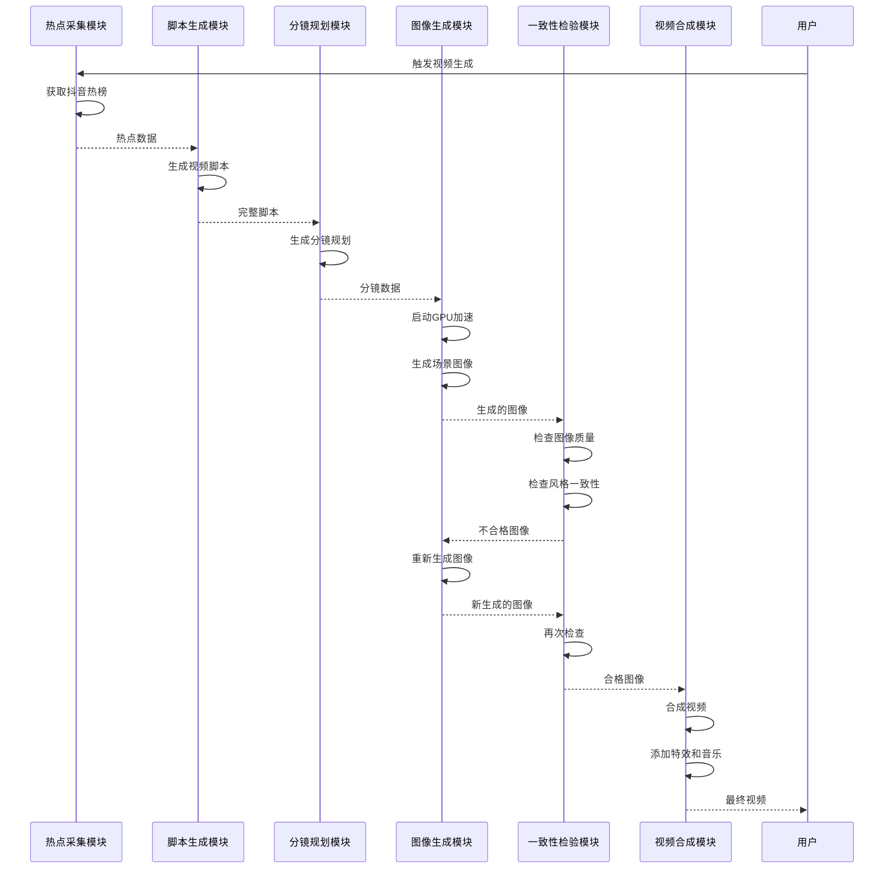

# AI视频生成系统 - 核心功能流程图

## 🎯 核心功能概述

AI视频生成系统的核心功能包括从热点采集到视频合成的完整流程，通过GPU加速实现高质量、高效率的视频生成。

### 核心功能列表
| 功能模块 | 主要职责 | 技术亮点 |
|----------|----------|----------|
| 热点采集 | 获取抖音热门话题 | 实时数据抓取 |
| 脚本生成 | 生成视频脚本 | AI大模型驱动 |
| 分镜规划 | 设计视频分镜 | 结构化分镜生成 |
| 图像生成 | 生成场景图像 | GPU加速（NVIDIA RTX 4060） |
| 一致性检验 | 检查图像风格 | AI质量控制 |
| 视频合成 | 合成最终视频 | 专业视频特效 |

## 🔄 核心功能流程图



## 📋 核心功能详细流程

### 1. 热点采集模块



**核心逻辑**：
- 调用抖音爬虫API获取实时热榜数据
- 筛选热度高、适合视频创作的话题
- 保存热点数据到数据库

### 2. 脚本生成模块



**核心逻辑**：
- 基于热点主题生成结构化脚本
- 使用大模型API生成自然流畅的内容
- 输出包含场景描述、镜头切换和旁白的完整脚本

### 3. 分镜规划模块



**核心逻辑**：
- 将脚本转换为可视化分镜
- 为每个分镜生成详细的图像提示词
- 设计镜头构图和过渡效果
- 生成完整的分镜表

### 4. GPU加速图像生成模块



**核心逻辑**：
- 检查并启动GPU加速的ComfyUI服务
- 使用Flux模型生成高质量图像
- 利用NVIDIA RTX 4060 GPU加速处理
- 批量生成多个场景图像

### 5. 一致性检验模块



**核心逻辑**：
- 检查生成图像的质量
- 确保所有图像风格一致
- 自动标记需要重生成的图像
- 调整参数重新生成不合格图像

### 6. 视频合成模块



**核心逻辑**：
- 将图像序列合成为视频
- 添加背景音乐和视频特效
- 优化视频节奏和过渡效果
- 渲染并输出最终视频

## 🎯 核心功能执行顺序



## 📊 核心功能性能指标

| 功能模块 | 平均处理时间 | GPU利用率 | 成功率 |
|----------|--------------|-----------|--------|
| 热点采集 | 5-10秒 | 0% | 99% |
| 脚本生成 | 10-20秒 | 0% | 95% |
| 分镜规划 | 5-10秒 | 0% | 98% |
| 图像生成 | 20-30秒/张 | 60-80% | 90% |
| 一致性检验 | 5-10秒/张 | 30-50% | 95% |
| 视频合成 | 10-20秒 | 10-20% | 98% |

## 🔧 核心功能配置参数

### 图像生成参数
| 参数 | 推荐值 | 说明 |
|------|--------|------|
| 分辨率 | 1280x720 | 平衡质量和速度 |
| 采样步骤 | 20-30 | 推荐25步 |
| CFG值 | 7.0-8.0 | 控制生成图像与提示词的一致性 |
| 批量大小 | 1-2 | 根据GPU显存调整 |
| 采样器 | dpmpp_2m_karras | 高质量采样器 |

### GPU加速参数
| 参数 | 推荐值 | 说明 |
|------|--------|------|
| CUDA设备 | 0 | 使用主GPU |
| 显存模式 | normal | 8-16GB VRAM推荐 |
| GPU仅模式 | true | 强制使用GPU |
| 异步权重卸载 | true | 提高内存使用效率 |

## 🐛 核心功能故障排除

| 问题 | 可能原因 | 解决方案 |
|------|----------|----------|
| 图像生成失败 | GPU显存不足 | 降低分辨率或批量大小 |
| 脚本生成缓慢 | 大模型API延迟 | 检查网络连接或切换模型 |
| 分镜质量差 | 脚本描述不清晰 | 优化脚本生成提示词 |
| 风格不一致 | 提示词变化大 | 统一提示词风格 |
| 视频合成失败 | 图像格式错误 | 检查图像文件格式 |

## 🚀 核心功能优化建议

1. **热点采集优化**
   - 增加热点数据缓存机制
   - 优化热点筛选算法

2. **图像生成优化**
   - 启用xformers加速
   - 优化模型加载速度
   - 实现并行图像生成

3. **一致性检验优化**
   - 增加预生成检查
   - 优化质量评估算法
   - 实现增量检查

4. **视频合成优化**
   - 优化渲染参数
   - 实现批量视频合成
   - 优化内存使用

## 🎯 核心功能应用场景

### 场景1：热点追踪视频
- **输入**：抖音热门话题
- **输出**：10-30秒热点追踪视频
- **特点**：快速响应热点，高传播性

### 场景2：教育科普视频
- **输入**：科普主题
- **输出**：1-5分钟教育视频
- **特点**：结构化内容，高质量图像

### 场景3：产品宣传视频
- **输入**：产品信息
- **输出**：30-60秒宣传视频
- **特点**：专业风格，品牌一致性

### 场景4：创意短片
- **输入**：创意主题
- **输出**：1-3分钟创意视频
- **特点**：艺术风格，视觉冲击力

## 📋 核心功能调用示例

### Python代码示例
```python
# 导入核心功能模块
from core.video_generator import VideoGenerator

# 初始化视频生成器
generator = VideoGenerator({
    'comfyui_url': 'http://127.0.0.1:8188',
    'gpu_acceleration': True,
    'output_dir': 'output/videos'
})

# 执行核心功能流程
result = generator.generate_video({
    'keywords': ['风景', '自然'],
    'style': 'cinematic',
    'duration': 10,
    'batch_size': 1
})

# 获取生成结果
if result['success']:
    print(f"视频生成成功: {result['final_video']}")
else:
    print(f"视频生成失败: {result['error']}")
```

---

**核心功能流程图已生成完成！** 🎉

这个流程图详细展示了AI视频生成系统的核心功能，从热点采集到视频合成的完整流程，帮助理解和使用系统的核心功能。