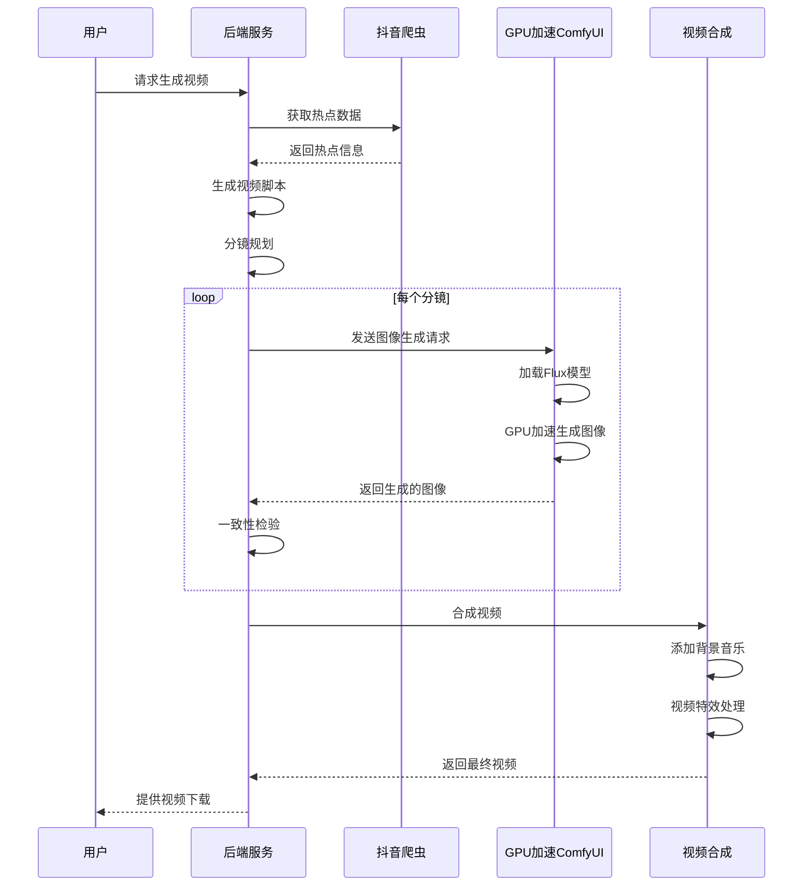
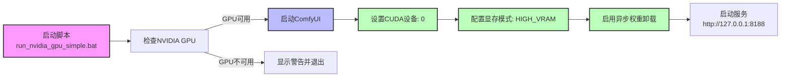
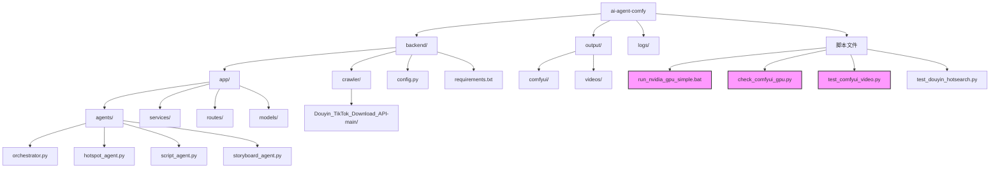
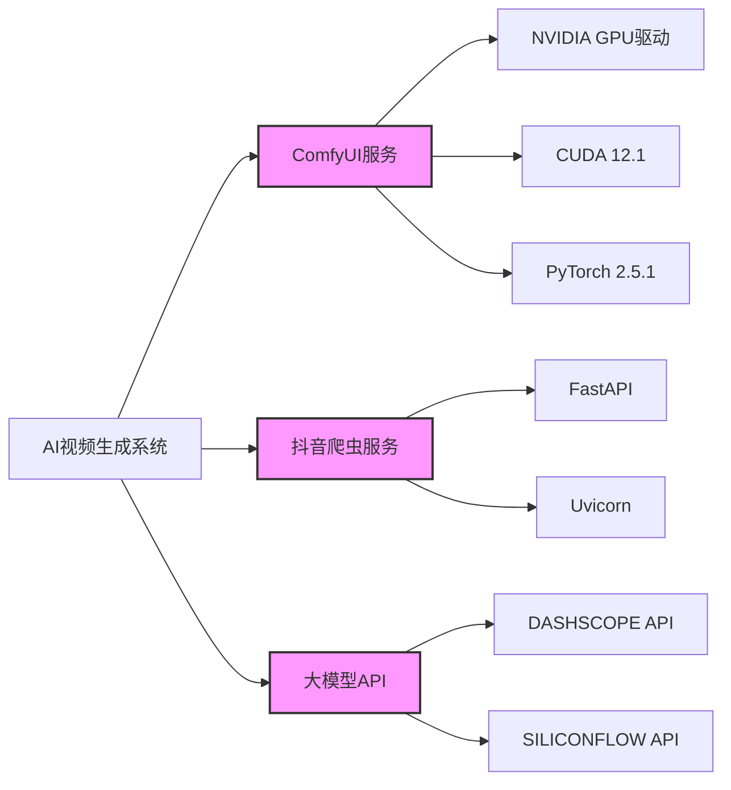
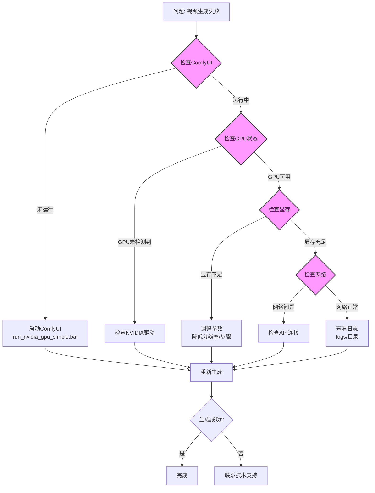
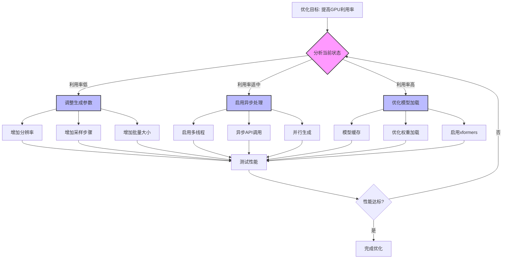

# AI视频生成系统 - GPU加速结构图

## 🎯 系统架构图

```mermaid
flowchart TD
    A[用户请求] --> B[热点采集模块]
    B --> C[脚本生成模块]
    C --> D[分镜规划模块]
    D --> E[GPU加速图像生成]
    E --> F[一致性检验模块]
    F --> G[视频合成模块]
    G --> H[最终视频输出]
    
    subgraph GPU加速核心
        E1[ComfyUI服务<br>(--gpu-only --cuda-device 0)]
        E2[NVIDIA GPU<br>RTX 4060 Laptop]
        E3[Flux图像生成模型]
        E --> E1 --> E2
        E1 --> E3
    end
    
    subgraph 辅助服务
        I[抖音爬虫服务<br>端口:80]
        J[后端API服务<br>端口:5000]
    end
    
    B --> I
    G --> J
    
    style E fill:#f9f,stroke:#333,stroke-width:2px
    style E1 fill:#bbf,stroke:#333,stroke-width:2px
    style E2 fill:#bfb,stroke:#333,stroke-width:2px
    style E3 fill:#ffb,stroke:#333,stroke-width:2px
```

## 🔄 视频生成工作流程图



## 📊 GPU加速配置图



## 📁 项目文件结构图



## 🎨 图像生成模块结构图

```mermaid
flowchart TD
    A[分镜描述] --> B[提示词生成]
    B --> C[ComfyUI API调用]
    C --> D[GPU加速生成]
    
    subgraph GPU加速层
        D1[NVIDIA CUDA]<br>cuda:0
        D2[异步权重卸载]
        D3[固定内存分配]
    end
    
    D --> D1
    D --> D2
    D --> D3
    
    D --> E[图像输出]
    E --> F[一致性检验]
    F -->|通过| G[保存图像]
    F -->|不通过| H[重新生成]
    H --> A
    
    style D fill:#f9f,stroke:#333,stroke-width:2px
    style D1 fill:#bbf,stroke:#333,stroke-width:2px
    style D2 fill:#bbf,stroke:#333,stroke-width:2px
    style D3 fill:#bbf,stroke:#333,stroke-width:2px
```

## 📋 服务依赖关系图



## 🔧 故障排除流程图



## 🚀 性能优化流程图



---

## 使用说明

1. **查看结构图**：直接在IDE中打开此文件即可查看所有结构图
2. **修改结构图**：根据需要修改Mermaid代码
3. **导出结构图**：使用支持Mermaid的Markdown编辑器导出为图片
4. **集成到文档**：可以将特定的结构图复制到其他文档中使用

## 结构图类型说明

| 结构图类型 | 用途 | 核心内容 |
|----------|------|----------|
| 系统架构图 | 展示系统组成 | 各模块关系和GPU加速核心 |
| 工作流程图 | 展示生成流程 | 从请求到输出的完整流程 |
| GPU加速配置图 | 展示GPU配置 | 启动脚本到服务运行的过程 |
| 文件结构图 | 展示项目组织 | 项目文件的层次结构 |
| 图像生成模块图 | 展示图像生成 | 从分镜到图像输出的过程 |
| 服务依赖关系图 | 展示服务依赖 | 各服务之间的依赖关系 |
| 故障排除流程图 | 展示排错步骤 | 从问题到解决的流程 |
| 性能优化流程图 | 展示优化步骤 | 提高GPU利用率的方法 |

---

**结构图已生成完成！** 🎉

可以直接在IDE中查看和使用这些结构图，帮助理解和使用AI视频生成系统。